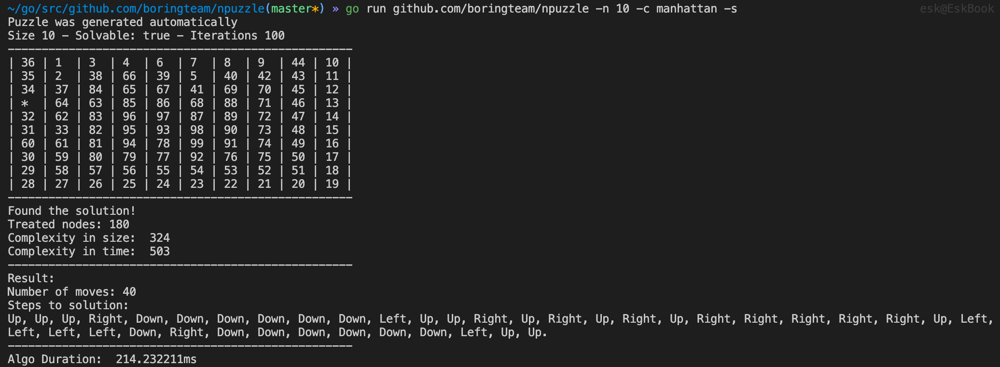
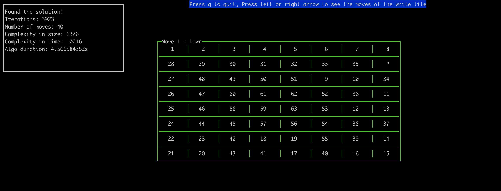

# Npuzzle

### Install

`go get -v -u github.com/boringteam/npuzzle`

### Run 

`go run github.com/boringteam/npuzzle [options]`

### Examples

`go run github.com/boringteam/npuzzle -n 10 -c manhattan -s`



`go run github.com/boringteam/npuzzle -n 8 -c manhattan -s -v`




### Usage

```
usage: npuzzle [-h|--help] [-n|--size "<value>"] [-s|--solvable]  
               [-u|--unsolvable] [-i|--iterations "<value>"] [-f|--file  
               "<value>"] [-v|--visual] [-c|--heuristic "<value>"]  
  
               Prints provided string to stdout  

Arguments:  

  -h  --help        Print help information  
  -n  --size        Size of the N-puzzle's side. Must be >= 3  and <= 180  
  -s  --solvable    Forces generation of a solvable puzzle. Overrides -u  
  -u  --unsolvable  Forces generation of an unsolvable puzzle  
  -i  --iterations  Number of iterations to shuffle the puzzle  
  -f  --file        Path to the txt file to read from  
  -v  --visual      If the size of the puzzle is <= 30, get a nice visual of  
                    the white tile move  
  -c  --heuristic   Choose among `manhattan`, `euclidean` `hamming` or  
                    `linearconflict` heuristics. Default: manhattan  
```